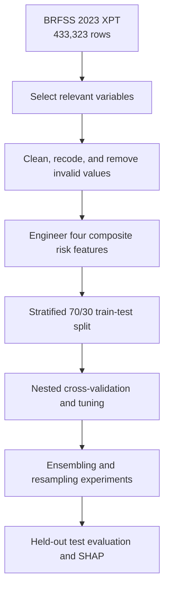

# Early Prediction of Diabetes Risk


Machine-learning models for identifying people at elevated risk of **diabetes or pre-diabetes** from demographic, behavioral, and health-related survey data. The project uses the 2023 CDC Behavioral Risk Factor Surveillance System (BRFSS) and emphasizes recall-aware evaluation because missed positive cases are especially costly in a screening setting.

> This project is intended for research and educational use. It is a risk-screening experiment, not a clinical diagnostic system.

## Project highlights

- Processes **433,323 raw survey records** and **350 original variables**.
- Produces a cleaned modeling dataset of **259,269 respondents**.
- Uses **27 predictors** spanning metabolic, behavioral, health, and socioeconomic factors.
- Compares **10 classification algorithms** with nested cross-validation and hyperparameter tuning.
- Evaluates class weighting, balanced random forests, NearMiss, SMOTEENN, and voting ensembles.
- Uses SHAP to explain the most influential risk factors.
- Reserves a stratified **30% held-out test set (77,781 respondents)** for final evaluation.

## Repository contents

| Path | Description |
| --- | --- |
| [`Diabetes_prediction.ipynb`](Diabetes_prediction.ipynb) | Complete workflow: loading, cleaning, EDA, feature engineering, model selection, explainability, ensembling, and final evaluation. |
| [`Data_Mining_Report-7.pdf`](Data_Mining_Report-7.pdf) | Full project report with methodology, results, discussion, references, and contribution overview. |
| [`data_zip/LLCP2023.XPT.zip`](data_zip/LLCP2023.XPT.zip) | Compressed CDC BRFSS 2023 data in SAS XPORT format. |

> **Dataset location:** The dataset is included in this repository under the [`data_zip`](data_zip/) folder. The notebook reads the compressed file from `data_zip/LLCP2023.XPT.zip` through its GitHub raw URL, so no separate manual download is required.

## Problem formulation

The target is derived from the BRFSS variable `DIABETE4`:

- `1`: respondent reports diabetes or pre-diabetes
- `0`: respondent does not report diabetes or reports diabetes only during pregnancy

Invalid or ambiguous responses are removed according to BRFSS coding conventions. After preprocessing, positive cases represent approximately **17.1%** of the cleaned dataset, making class imbalance a central modeling challenge.

## Workflow



### Preprocessing

The pipeline:

1. Selects diabetes-related survey variables.
2. Removes duplicates using respondent and questionnaire metadata.
3. Drops missing, refused, unknown, and invalid responses.
4. Recodes binary and ordinal survey values into modeling-friendly representations.
5. Rescales BMI to its standard unit.
6. Standardizes continuous variables inside each modeling pipeline to avoid leakage.

The final predictors include:

- **Continuous:** BMI, poor mental-health days, poor physical-health days
- **Ordinal:** general health, age group, education, income, smoking status, and engineered scores
- **Binary:** high blood pressure, high cholesterol, physical activity, cardiovascular history, healthcare access, and related indicators

### Engineered risk features

| Feature | Definition |
| --- | --- |
| Metabolic Syndrome | Count of overweight/obesity, high blood pressure, and high cholesterol indicators (0-3). |
| High CVD Risk Profile | Heart disease, stroke, or the combination of hypertension, high cholesterol, and current smoking. |
| Comorbidity Count | Count of heart disease, stroke, and kidney disease indicators. |
| Healthy Lifestyle Score | Sum of non-smoking, physical activity, normal BMI, and no heavy alcohol use (0-4). |

## Models and evaluation

Ten model families are compared:

- Logistic Regression
- Gaussian Naive Bayes
- Complement Naive Bayes
- Linear SVM via stochastic gradient descent
- XGBoost
- CatBoost
- LightGBM
- AdaBoost
- Histogram Gradient Boosting
- Balanced Random Forest

Model selection uses **4-fold inner and 4-fold outer stratified nested cross-validation**, with F1-score as the tuning objective. Final hyperparameters are selected using an additional 5-fold grid search. Accuracy, precision, recall, F1-score, and AUC-ROC are reported together so that the majority class does not conceal poor diabetes detection.

## Results

### Nested cross-validation

| Model | Accuracy | Precision | Recall | F1 | AUC-ROC |
| --- | ---: | ---: | ---: | ---: | ---: |
| LightGBM | 0.780 | 0.405 | 0.622 | **0.491** | **0.810** |
| XGBoost | 0.780 | 0.405 | 0.621 | 0.490 | **0.810** |
| CatBoost | 0.780 | 0.405 | 0.618 | 0.490 | 0.809 |
| Logistic Regression | 0.719 | 0.349 | 0.745 | 0.475 | 0.804 |
| Linear SVM | 0.722 | 0.351 | 0.733 | 0.474 | 0.802 |
| Balanced Random Forest | 0.705 | 0.340 | **0.769** | 0.471 | 0.805 |

Gradient-boosted models provide the strongest F1/AUC balance. Balanced Random Forest and other class-balanced linear models trade precision for higher recall, which can be useful when minimizing missed cases is the priority.

### Held-out test set

| Model | Accuracy | Precision | Recall | F1 | AUC-ROC |
| --- | ---: | ---: | ---: | ---: | ---: |
| Soft Voting Ensemble | **0.743** | **0.369** | 0.713 | **0.486** | **0.808** |
| Balanced Random Forest | 0.704 | 0.338 | **0.770** | 0.470 | 0.804 |
| LightGBM + SMOTEENN | 0.742 | 0.368 | 0.714 | **0.486** | 0.806 |

On the notebook's held-out test split, the soft-voting ensemble offers the strongest overall F1/AUC balance, while Balanced Random Forest reaches the highest recall.

Cost-sensitive learning performs about as well as the tested resampling approaches while being more computationally efficient. NearMiss loses too much majority-class information, and SMOTEENN does not materially improve F1.

### Explainability

SHAP analysis shows that the most consistently influential predictors are:

1. General health
2. High blood pressure
3. BMI
4. Age group
5. High cholesterol
6. Comorbidity count

These rankings are stable across model families and align with established Type 2 diabetes risk factors.

## Getting started

### 1. Clone the repository

```bash
git clone https://github.com/murodzodam01/data_mining_project.git
cd data_mining_project
```

### 2. Create an environment and install dependencies

```bash
python -m venv .venv
```

Activate it on Windows:

```powershell
.venv\Scripts\Activate.ps1
```

Activate it on macOS or Linux:

```bash
source .venv/bin/activate
```

Install the required packages:

```bash
pip install jupyter pandas numpy matplotlib seaborn scikit-learn imbalanced-learn xgboost catboost lightgbm shap tqdm requests
```

### 3. Run the notebook

```bash
jupyter notebook Diabetes_prediction.ipynb
```

The data is stored in the repository's `data_zip` folder. The notebook downloads `data_zip/LLCP2023.XPT.zip` directly from this repository, opens `LLCP2023.XPT`, and loads it with `pandas.read_sas`:

```python
import io
import zipfile
import requests
import pandas as pd

zip_url = (
    "https://raw.githubusercontent.com/murodzodam01/"
    "data_mining_project/main/data_zip/LLCP2023.XPT.zip"
)

response = requests.get(zip_url, timeout=300)
response.raise_for_status()

with zipfile.ZipFile(io.BytesIO(response.content)) as archive:
    with archive.open("LLCP2023.XPT") as file:
        df = pd.read_sas(file, format="xport", encoding="latin1")
```

> The full experiment includes extensive grid searches, nested cross-validation, SHAP analysis, and resampling. Runtime and memory usage can therefore be substantial. The committed notebook retains its saved outputs for inspection without rerunning every experiment.

## Reproducibility notes

- The train/test split is stratified with `random_state=1`.
- Cross-validation folds are stratified and shuffled with `random_state=42` where configured.
- Scaling and resampling occur inside pipelines to limit data leakage.
- The held-out test set is used only after model selection.
- SMOTEENN results use 2-fold cross-validation because of computational cost and should be interpreted more cautiously than the main 5-fold estimates.

## Limitations

- BRFSS responses are self-reported and do not include clinical biomarkers such as HbA1c.
- The cross-sectional design supports prediction, not causal conclusions.
- Precision remains modest because of the real-world class imbalance.
- Approximately 29% of positive test cases are missed by the selected ensemble.
- Any real deployment would require external validation, threshold calibration, fairness analysis, privacy review, and confirmatory clinical testing.

## Contributors

- **Muhammad Murodzoda** - modeling pipeline, nested cross-validation, hyperparameter search, stability analysis, ensembles, resampling, and held-out evaluation
- **Fatima Iqbal** - dataset and feature selection, feature engineering, class-balance analysis, EDA, modeling methodology, and evaluation metrics
- **Özlem Ölçer** - dataset and feature selection, cleaning and recoding pipeline, engineered features, and preprocessing documentation
- **Tim Mauscherning** - clinically motivated proxy features, model evaluation, optimization analysis, and robustness checks
- **Manuel Dieterle** - model-selection discussions, results interpretation, literature comparison, and final report production
- **Xuemei Wang** - project framing, target definition, evaluation priorities, report structure, and final review

## Data source and references

The project uses the **CDC Behavioral Risk Factor Surveillance System 2023** public-use dataset. Key methodological and clinical references are documented in the [full project report](Data_Mining_Report-7.pdf).

- [CDC BRFSS](https://www.cdc.gov/brfss/)
- [CDC Type 2 diabetes risk factors](https://www.cdc.gov/diabetes/risk-factors/index.html)
- [International Diabetes Federation - Diabetes Atlas](https://diabetesatlas.org/)

## License and responsible use

No repository license is assumed by this README. Add a license file before redistributing code beyond the terms permitted by the data source and dependency licenses. Predictions from this project must not be interpreted as a medical diagnosis.
